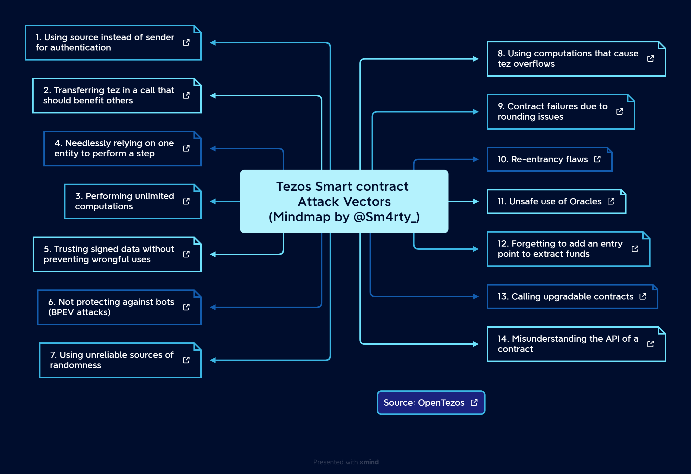

# Awesome Tezos Security 
This repository serves as a comprehensive resource that delves into the various security aspects of the Tezos blockchain and provides best practices for developing secure smart contracts.

## Tezos Smart contract Vulnerability List:

**PDF Version:** [Tezos-Attack-Vectors.pdf](assets/Tezos-Attack-Vectors.pdf)

### References:
[Common Tezos Smart contract Vulnerability ~ OpenTezos](https://opentezos.com/smart-contracts/avoiding-flaws/)
[Lilolang Security](https://ligolang.org/docs/tutorials/security/?lang=jsligo)

---

## Security checklist for Tezos smart contracts
- [TezosSecurityBaselineChecking](https://github.com/InferenceAG/TezosSecurityBaselineChecking)
- [TezosSecurity Checklist V1 by Inference](https://github.com/InferenceAG/TezosSecurityAssessmentChecklist/blob/master/publications/v1.0/Tezos%20smart%20contract%20security%20assessment%20checklist%20-%20v1.0.pdf)
- [TezosSecurity Checklist V1.1 by Inference](https://github.com/InferenceAG/TezosSecurityAssessmentChecklist/blob/master/publications/v1.1/Tezos%20smart%20contract%20security%20assessment%20checklist%20-%20v1.1.pdf)
- [TezosSecurity Checklist V1.2 by Inference](https://github.com/InferenceAG/TezosSecurityAssessmentChecklist/blob/master/publications/v1.2/Tezos%20smart%20contract%20security%20assessment%20checklist%20-%20v1.2.pdf)
- [TezosSecurity Checklist V2 by Inference](https://github.com/InferenceAG/TezosSecurityAssessmentChecklist/blob/master/publications/v2.0/Tezos%20smart%20contract%20security%20assessment%20checklist%20-%20v2.0.pdf)

---

## Tezos Audit Reports:
- [Inference Tezos Audit Reports](https://github.com/InferenceAG/ReportPublications)
- [LeastAuthority Tezos Audit Reports](https://medium.com/least-authority/https-medium-com-least-authority-five-security-audits-for-the-tezos-foundation-7e7375cf055b)
- [RAMP SECURITY AUDITS](https://github.com/RAMP-DEFI/RAMP_SECURITY_AUDITS_TEZOS/blob/main/Smart%20contract%20security%20audit%20report%20-%20RAMP_VERSION_TEZOS.pdf)
- [Runtime Verification Audit for Quipuswap](https://github.com/runtimeverification/publications/blob/main/reports/smart-contracts/Quipuswap.pdf)
- [Runtime Verification Audit for Quipuswap StableSwap AMM ](https://github.com/runtimeverification/publications/blob/main/reports/smart-contracts/quipuswap-stableswap.pdf)

## Tezos Formal Verification Reports:
- [Tezos Dexter V2](https://github.com/runtimeverification/publications/blob/main/reports/smart-contracts/Tezos-Dexter.pdf)
- [Tezos Liquidity Baking Contract](https://github.com/runtimeverification/publications/blob/main/reports/smart-contracts/Tezos-Dexter.pdf)

---

## Security Blogs:
- [Michelson code reviews](https://inference.ag/blog/2022-05-11-michelson/)
- [LigoLang Security](https://ligolang.org/docs/tutorials/security/)
- [Michelson Anti-Patterns](https://tezos.gitlab.io/developer/michelson_anti_patterns.html)
- [Testing and Debugging Ligo](https://ligolang.org/docs/advanced/testing?lang=jsligo)
---

## Gas Optimizations 
- [The Tezos gas model ](https://gitlab.com/tezos/tezos/-/blob/52a074ab3eb43ad0087804b8521f36cb517f7c28/docs/whitedoc/gas_consumption.rst)
- [Tezos Code Optimization](https://github.com/InferenceAG/TezosCodeOptimization)
- [Ligolang Gas Optimizations](https://ligolang.org/docs/tutorials/optimisation/?lang=jsligo)

---

## Video Tutorials: 
- [Tezos research and development Series by Nomadiclabs](https://www.youtube.com/watch?v=2jd-1VxzmQ0&list=PLfjHt2_9f_EwJh1Yr3zgRZnqrc-koohC7)
- [Building a dapp on Tezos in SmartPy - Part 1](https://www.youtube.com/watch?v=yZs06D4tjI4)
- [Building a dapp on Tezos in SmartPy - Part 2](https://www.youtube.com/watch?v=CCk5IO-IzZE&)
- [How to build a front-end of a Tezos dapp](https://www.youtube.com/watch?v=wN3OvPh0OzY)
- [Token Standards on Tezos FA1.2 & FA2](https://www.youtube.com/watch?v=zKCpbVQ1E14)
- [Building a dapp on Tezos in LIGO - Part 1](https://www.youtube.com/watch?v=IvZdupLVyGc)
- [Building a dapp on Tezos in LIGO - Part 2](https://www.youtube.com/watch?v=WRvRIHPjVBc)

---

## Miscellaneous Resources:
- [Awesome Tezos](https://github.com/[kevinelliott](https://github.com/kevinelliott/awesome-tezos)/awesome-tezos)
- [Awesome SmartPy](https://github.com/JonathanReiss15/awesome-smartpy)
- [Open Tezos](https://opentezos.com/)
- [Tezos Developer Resources](https://tezos.gitlab.io/index.html)
